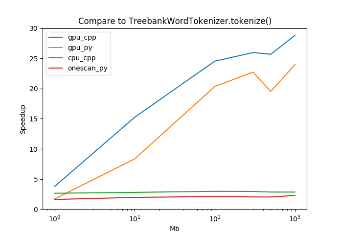

# Fast Tokeizers
Fast and rule-based tokenizers are implemented in C++ with Cuda and Python with Pycuda. The rules are producing Penn Treebank style tokenization of English text and following the rules similar to nltk's TreebankWordTokenizer(http://www.nltk.org/_modules/nltk/tokenize/treebank.html). The fastest tokenizer can be up to 20X speedup comparing to nltk's TreebankWordTokenizer.

-
# 1. Application Overview
GpuTokenize.cu and GpuTokenize.h

		C++ and Cuda application
		provides splitAndSaveToFile() or split() to tokenize a large input string into tokens.

CpuTokenize.cpp and CpuTokenize.h

		C++ application	
		provides splitAndSaveToFile_cpu() or split_cpu() to tokenize a large input string into tokens.

Onescan.py

		python application	
		implements the PTB rules to tokenize a large string during one scan.

GpuTokenize.py

		python and pycuda application
		uses Pycuda to tokenize a large input string into tokens.

-
# 2. Providing Folder and Files
	Files: test.sh, Myplot.py, Compare2PTB.py and README.md

Folder 'cpp'

	Files: GpuTokenize.cu, GpuTokenize.h, CpuTokenize.cpp, CpuTokenize.h, Tok.cpp, Tok.h, Main.cpp and Makefile

Folder 'py'

	Files: GpuTokenize.py, Onescan.py and runtok.py

-
# 3. Data
dataset 1: www.gutenberg.org/ebooks/20417 www.gutenberg.org/ebooks/5000 www.gutenberg.org/ebooks/4300

dataset 2: http://cmpt732.csil.sfu.ca/datasets/a1-pagecounts-2.zip

-
# 4. Running the Application
Assuming Cuda and Pycuda are installed.

1) running C++:

	cd /path_to_cpp/cpp
	make
	./tok <data_path> <optional: 1 for gpu, 2 for cpu>

2) running Python:

	cd /path_to_cpp/cpp
	python runtok.py <data_path> <optional: 1 for GpuTokenizer.gpuTokenize(), 2 for OneScan.oneScanTokenizer()>

3) running test.sh:

	Adjust the data paths in test.sh and then 
	./test.sh

-
# 5. The basic idea for Gpu implementation
The tokenizing are divided into 2 steps. One is patching, in which each byte in the large string are patched with left and right bytes. Allow each GPU thread to mark each byte's left or right bytes as being joined or disjoined according to the rules.
The final step is to remove the patched bytes and split the tokens simultaneously.
 
-
# 6. Accuracy
All results from above Python applications are matched to the result from nltk's TreebankWordTokenizer. The C++ Gpu version have difficulty to handle a long repeating pattern since each byte in GPU thread only can see limited neighbors (window size is a fixed number).

-
# 7. Results
----------
Comparing to the nltk's TreebankWordTokenizer, the CPU versions are about 2x speedup while the GPU versions are 29x as shown below:

